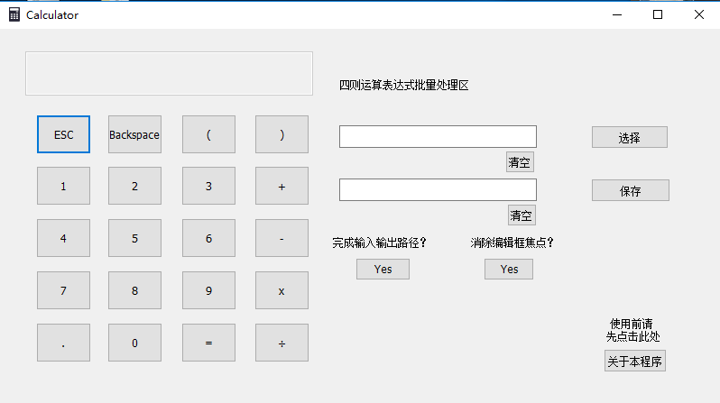

## object-oriented
加入 GitHub 后创建的第一个仓库，主要用来保存大一时候的《面向对象程序设计》课程的作业，主要是初学`C++`的一些应用。从现在来看，当时写的代码是丑陋的，基本算是大一时学习的一个历程吧，所以也没打算删除这个仓库。

## 作业链接
[第一次作业](https://www.cnblogs.com/fzuoop/p/5151314.html)——[大一上学期C语言学习心得总结](https://www.cnblogs.com/ZhaoxiCheung/p/5156178.html)

[第二次作业](https://www.cnblogs.com/fzuoop/p/5157122.html)——[第二次作业———“A+B Format”思路与总结](https://www.cnblogs.com/ZhaoxiCheung/p/5166290.html)

[第三次作业（计算器第一步）](https://www.cnblogs.com/fzuoop/p/5187275.html)——[第三次作业——计算器](https://www.cnblogs.com/ZhaoxiCheung/p/5206811.html)

[第四次作业（计算器第二步）](https://www.cnblogs.com/fzuoop/p/5326667.html)——[第四次作业——计算器（实现“+ - * /”）](https://www.cnblogs.com/ZhaoxiCheung/p/5361189.html)

[第五次作业（计算器第三步）](https://www.cnblogs.com/fzuoop/p/5451293.html)——[第五次作业——计算器（增加一种读取四则运算表达式的方式）](https://www.cnblogs.com/ZhaoxiCheung/p/5468727.html)

[第六次作业（计算器第四步）](https://www.cnblogs.com/fzuoop/p/5524803.html)——[第六次作业——利用MFC实现计算器图形界面以及简单四则运算表达式批处理](https://www.cnblogs.com/ZhaoxiCheung/p/5538890.html)

[第七次作业](https://www.cnblogs.com/fzuoop/p/5594972.html)——[第七次作业——学末总结](https://www.cnblogs.com/ZhaoxiCheung/p/5613069.html)

## 主要内容
几次作业最后的走向是完成一个支持简单四则运算的计算器——[Caculator](https://github.com/ZhaoxiZhang/object-oriented/blob/master/GUI%20Calculator/Calculator.exe)，最后的成品在[GUI Calculator](https://github.com/ZhaoxiZhang/object-oriented/tree/master/GUI%20Calculator)，界面用`MFC`实现。

